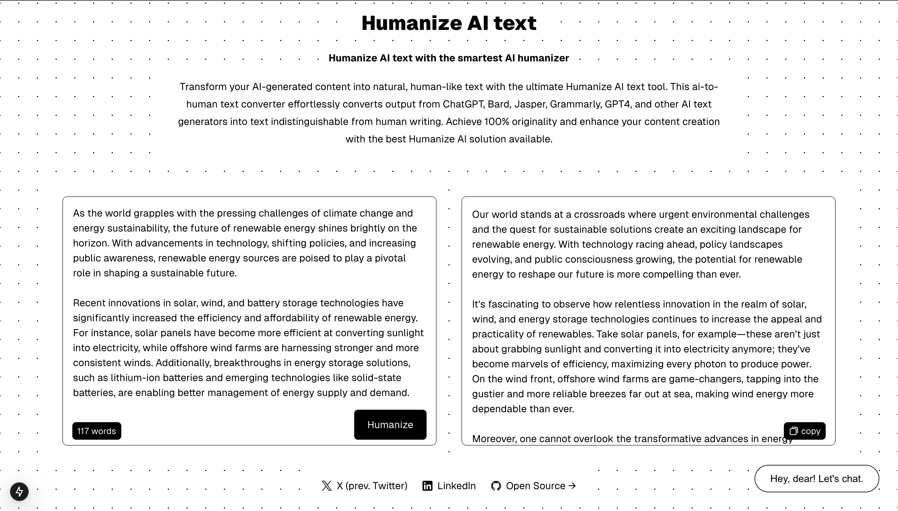
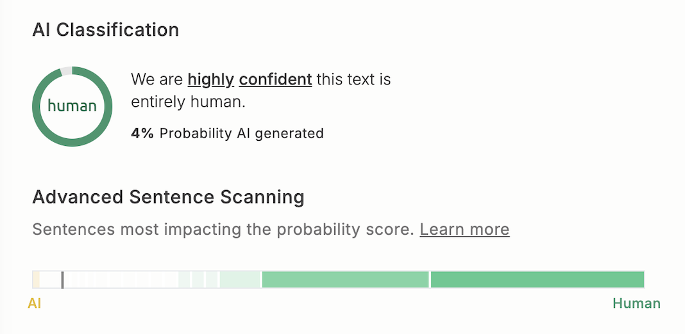
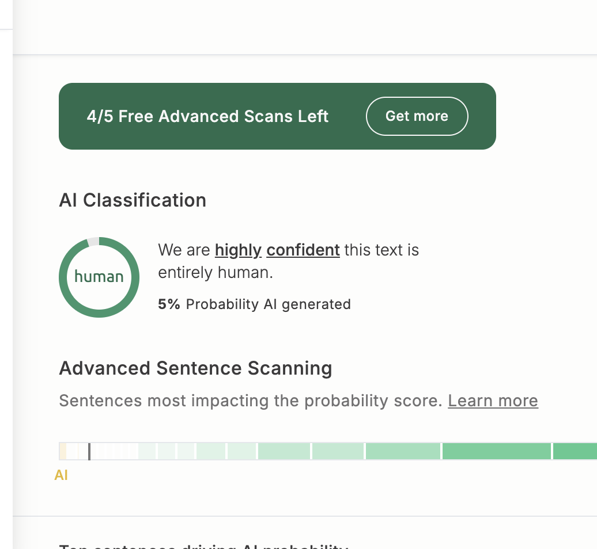

# HumanAIze

<div align="center" style="padding: 10px; border: 1px solid #ccc; background-color: #f9f9f9; border-radius: 10px; margin-bottom: 20px;">
    <h2 style="margin: 0; font-size: 24px; color: #333;">HumanAIze is OUT! 🐐</h2>
    <p style="margin: 5px 0 0 0; font-size: 16px; color: #666;">Read all about it on <a href="https://medium.com/@abdibrokhim/humanize-ai-text-with-the-smartest-ai-humanizer-heres-how-40f151f65135" style="text-decoration: underline; color: #1a73e8;"> Medium →</a></p>
</div>

<!-- markdownlint-disable MD030 -->

# [](https://humanaize.vercel.app/)

<p align="center"><strong>
    HumanAIze AI text with the smartest AI humanizer! 🚀
</strong></p>
<p align="center"><strong>
    it's Absolutely FREE. 💜
</strong></p>
<p align="center"><strong>
    and Open Source. 🌟
</strong></p>


## 🚀 Watch on YouTube
How to use HumanAIze? Watch on YouTube, A$AP! 🚀

[](https://youtu.be/CLrENdjIe58?si=i8k6A2EtXFwc1fSQ)

## 🐐 A couple of results from real stuff

> ps: results from my daad scholarship application.




### Try it now -> [HumanAIze, click here](https://humanaize.vercel.app/) 
(it's absolutely FREE! 🎉)

### 🚀 Powered by AI/ML API
With AI/ML API I can access to over 200 AI models with one API endpoint. It's super cool! Now I can switch between models with just one click. 🔥 [Here's is how... click me](https://huggingface.co/spaces/abdibrokhim/ai-sticker-maker/blob/3538c96ae8838c2b4e94977632150f7bd3c87f61/app.py#L117)

## 📦 Run Locally

Clone the repository with:

```shell
git clone https://github.com/abdibrokhim/humanaize.git
```

Install the dependencies with:

```shell
npm install
```
and,

Copy the `.env.example` file to `.env` and fill in the required environment variables.

```shell
cp .env.example .env
```

Here you should put your stuff:
    
```shell
NEXT_PUBLIC_OPENAI_API_KEY=sk-proj-
NEXT_PUBLIC_AIML_API_KEY=...
NEXT_PUBLIC_CLERK_PUBLISHABLE_KEY=pk_test_
CLERK_SECRET_KEY=sk_test_
NEXT_PUBLIC_CLERK_SIGN_IN_URL=/sign-in
NEXT_PUBLIC_CLERK_SIGN_UP_URL=/sign-up
```
then,

Run the development server with:

```shell
npm run dev
```
Open http://localhost:3000 in your browser.

## 🦄 Important

if it was useful. Please consider [donate](https://buymeacoffee.com/abdibrokhim/). 

I will buy custom domain for this project. 

Let's buy this domain `humanaize.pro`. 

Domain name on Namecheap: https://www.namecheap.com/domains/registration/results/?domain=humanaize.pro

## 🥂 Discord bot

Join our community Discord server [Open Community](https://discord.gg/nVtmDUN2sR). 

We cook some cool stuff there. [imcook.in](https://imcook.in) with you guys. 🧑‍🍳

## 🐞 Bug report or Feature request

Message me at abdibrokhim@gmail.com

Or just create an issue over here.

## 👋 Want to Contribute?

Kindly check the [CONTRIBUTING.md](https://github.com/abdibrokhim/loom-dl-web/blob/main/CONTRIBUTING.md)

## ⭐️ Star History

[](https://star-history.com/#abdibrokhim/humanaize&Date)

## 🙏 Support
If you wish to support further development and feel extra awesome, you can [Donate](https://buymeacoffee.com/abdibrokhim/), become a [Patron](https://www.patreon.com/abdibrokhim) or [Follow on LinkedIn](https://www.linkedin.com/in/abdibrokhim/).

## 🦄 Want to learn builf stuff from coool guy?

Here's my topmate profile https://topmate.io/join/abdibrokhim book session with me. it's Absolutely FREE! 🎉 (free services for everyone , i want to help as much as people possible, so far 200K developers, let's goooooo, [imcook.in](https://imcook.in))