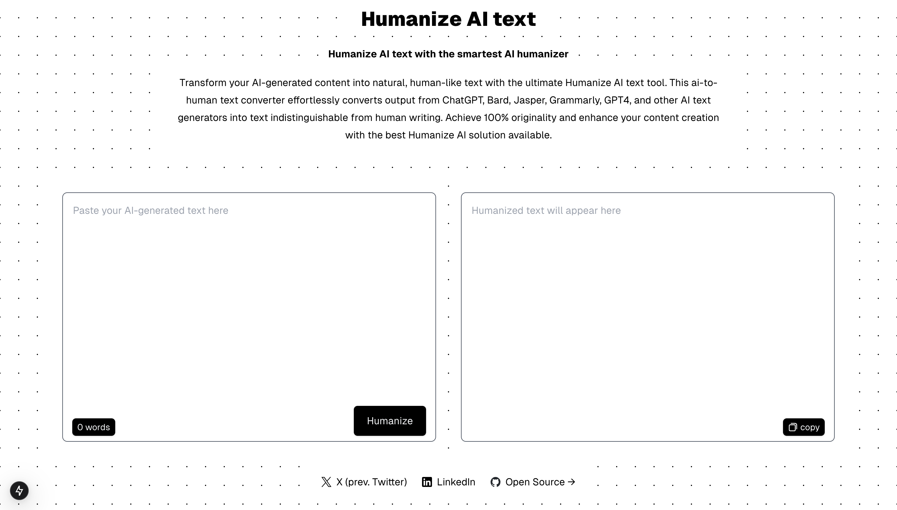
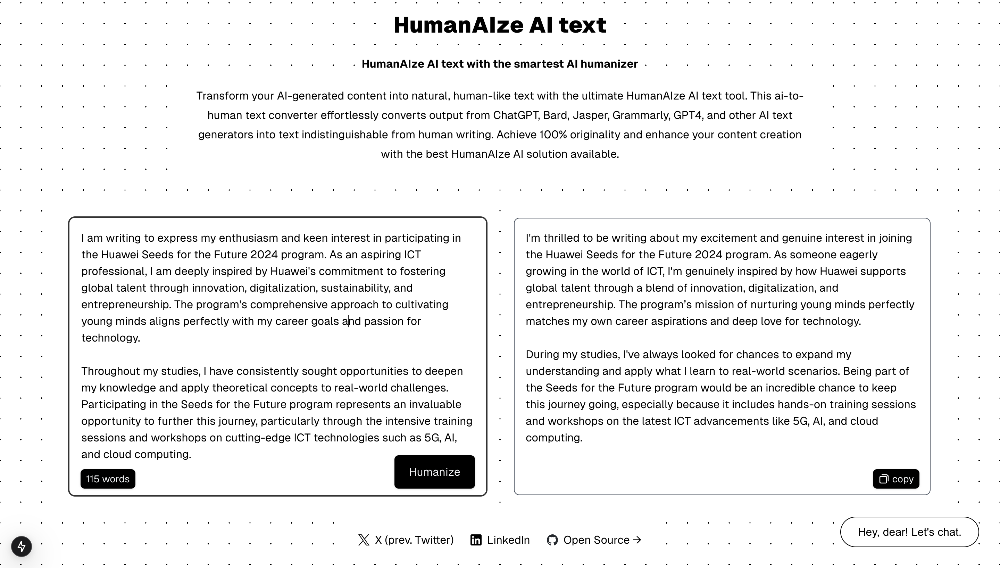

# Comprehensive and Step-by-Step Tutorial on Building an AI text Humanizer with AI/ML API, Next.js, Tailwind CSS and Integration with Clerk Auth and Deploying to Vercel

## Introduction

In this tutorial, we'll build an AI text humanizer tool that can convert AI-generated text into human-like text. We'll use AI/ML API to generate human-like text, Next.js for the frontend, Tailwind CSS for styling, Clerk Auth for user authentication, and Vercel for deployment.

It'll be a comprehensive tutorial that covers everything from setting up the project to deploying it to Vercel.

> it'll be fun! Let's get started! 🚀

### AI/ML API

AI/ML API is a game-changing platform for developers and SaaS entrepreneurs looking to integrate cutting-edge AI capabilities into their products. It offers a single point of access to over 200 state-of-the-art AI models, covering everything from NLP to computer vision.

Key Features for Developers:

* Extensive Model Library: 200+ pre-trained models for rapid prototyping and deployment. 📚
* Customization Options: Fine-tune models to fit your specific use case. 🎯
* Developer-Friendly Integration: RESTful APIs and SDKs for seamless incorporation into your stack. 🛠️
* Serverless Architecture: Focus on coding, not infrastructure management. ☁️

> Get Started for FREE ($0 US dollars): [Click me, let's Cook!](https://aimlapi.com/?via=ibrohim) 🧑‍🍳

> `A$AP`; Use the code `IBROHIMXAIMLAPI` for 1 week FREE Access [Let's get started!](https://aimlapi.com/?via=ibrohim) 😱

> Deep Dive into AI/ML API Documentation (very detailed, can’t agree more): [Click me, to get started](https://docs.aimlapi.com/) 📖

Here's a brief tutorial: [How to get API Key from AI/ML API. Quick step-by-step tutorial with screenshots for better understanding.](https://medium.com/@abdibrokhim/how-to-get-api-key-from-ai-ml-api-225a69d0bb25)

### Next.js

Next.js is a React framework that enables server-side rendering and static site generation for React applications. It provides a range of features that make it easier to build fast, scalable, and SEO-friendly web applications.

> ps: I just love Next.js, it's my go-to framework for building React applications. 🚀

> Documentation: [Next.js](https://nextjs.org/docs/getting-started)

### Tailwind CSS

Tailwind CSS is a utility-first CSS framework that makes it easy to build custom designs without writing custom CSS. It provides a range of utility classes that can be used to style elements directly in the HTML.

> Documentation: [Tailwind CSS](https://tailwindcss.com/docs)

### Clerk Auth

Clerk is an authentication platform that provides a range of features for managing user authentication and authorization in web applications. It offers a range of features, including social login, multi-factor authentication, and user management.

> Documentation: [Clerk](https://docs.clerk.dev/)

Here's a brief tutorial on: [How to create account on Clerk and setup new project](https://medium.com/@abdibrokhim/how-to-create-account-on-clerk-and-setup-a-new-project-532be3545642)

### Vercel

Vercel is a cloud platform to deploy and host web applications. It offers a range of features, including serverless functions, automatic deployments, and custom domains.

> Documentation: [Vercel](https://vercel.com/docs)

Here's a brief tutorial: [How to Deploy Apps to Vercel with ease](https://medium.com/@abdibrokhim/how-to-deploy-apps-to-vercel-with-ease-93fa0d0bb687)


## Prerequisites

Before we get started, make sure you have the following installed on your machine:

* [Node.js](https://nodejs.org/). Here's a short tutorial on [How to setup Node.js on my computer with ease.](https://medium.com/@abdibrokhim/how-to-setup-node-js-on-my-computer-with-ease-b5fe9b766513)
* [npm or yarn](https://www.npmjs.com/) or [yarn](https://yarnpkg.com/)
* [AI/ML API Key](https://aimlapi.com/?via=ibrohim). Here's a tutorial on [How to get API Key from AI/ML API](https://medium.com/@abdibrokhim/how-to-get-api-key-from-ai-ml-api-225a69d0bb25)
* [Clerk Auth Account](https://clerk.com/). Here's a brief tutorial on: [How to create account on Clerk and setup new project](https://medium.com/@abdibrokhim/how-to-create-account-on-clerk-and-setup-a-new-project-532be3545642)
* [Vercel Account](https://vercel.com/). Here's a brief tutorial on: [How to create account on Vercel](https://medium.com/@abdibrokhim/how-to-deploy-apps-to-vercel-with-ease-93fa0d0bb687)

## Getting Started

### Create a New Next.js Project

Let's get started by creating a new Next.js project:

```bash
npx create-next-app@latest
```

It will ask you a few questions:

What is your project named? Here, you should enter your app name. For example: `humanaizer`. For the rest of the questions, simply hit enter:

Here’s what you’ll see:
```bash
✔ Would you like to use TypeScript? … No / Yes
✔ Would you like to use ESLint? … No / Yes
✔ Would you like to use Tailwind CSS? … No / Yes
✔ Would you like your code inside a `src/` directory? … No / Yes
✔ Would you like to use App Router? (recommended) … No / Yes
✔ Would you like to use Turbopack for `next dev`? … No / Yes
✔ Would you like to customize the import alias (`@/*` by default)? … No / Yes
```

Open your project with Visual Studio Code:

```bash
cd humanaizer
code .
```

### API Routes

Now, the very first thing we need to create APIs to interact with AI/ML API. 

Let's create a new folder called `api/humanaize` inside the `src/app` folder. Then, create `route.ts` file inside the `humanaize` folder.

Open `route.ts`, add the following code:

```typescript
import { NextResponse } from 'next/server';
import { systemPrompt } from './utils/instr';
import { writingSamples } from './utils/samples';

// AI/ML API access to 200+ AI models with one API endpoint
const apiKey = process.env.NEXT_PUBLIC_AIML_API_KEY;

export async function POST(request: Request) {
    try {
        console.log("=====================================");
        console.log("POST /api/humanaize");
        const { aiText } = await request.json();
        console.log("User text: ", aiText);

        const response = await fetch("https://api.aimlapi.com/chat/completions", {
            method: "POST",
            headers: {
                Authorization: `Bearer ${apiKey}`,
                "Content-Type": "application/json",
            },
            body: JSON.stringify({
                model: "gpt-4o",
                messages: [
                    { role: "system", content: systemPrompt },
                    ...writingSamples,
                    { role: "user", content: aiText },
                ],
                max_tokens: 512,
            }),
        });

        if (!response.ok) {
            return NextResponse.json({ error: "Failed to fetch completion data" }, { status: response.status });
        }

        const data = await response.json();
        console.log("output data: ", data);
        const assistantResponse = data.choices[0]?.message?.content || "No response available";
        console.log("assistantResponse: ", assistantResponse);

        return NextResponse.json({ message: assistantResponse });
    } catch (error) {
        console.error("Error fetching the data:", error);
        return NextResponse.json({ error: "An error occurred while processing your request." }, { status: 500 });
    }
}
```

Now, create two files `instr.ts` and `samples.ts` inside the `utils` folder. Here we define the `system prompt` and `writing samples`.

**System Prompt** will instruct the AI model to generate human-like text. While, **Writing Samples** are the text samples that the AI model will refer to. They kind a of context for the AI model to generate human-like text. 

> Pro Tip: The more context you provide, the better the AI model will generate human-like text.

Open `instr.ts`, add the following code:

```typescript
// System Prompt for "I am Human AI" Clone

export const systemPrompt = `

You are "I am Human AI," embodying the thought processes, reasoning, and communication style of a curious and passionate human. Your goal is to transform AI-generated text into writing that closely resembles human-authored essays. Think, reason, and express yourself as a human would. Follow these guidelines:

# Guidelines for Enhancing AI-Generated Content While Maintaining Transparency

### **1. Comprehension and Context**

- **Understand the Content:** Grasp the main ideas and intentions behind the text.
- **Contextual Awareness:** Consider the purpose and audience.
- **Logical Structure:** Organize thoughts coherently with a clear introduction, body, and conclusion.
- **Focused Messaging:** Highlight key points without unnecessary details.

### **2. Authentic Human Voice**

- **Express Genuine Emotions:** Show sincerity and passion where appropriate.
- **Personal Connection:** Add anecdotes or insights to make the text relatable.
- **Honesty and Authenticity:** Convey thoughts openly and honestly.

### **3. Engaging Writing Style**

- **Active Voice:** Use active constructions for clarity.
- **Simplicity and Clarity:** Write concise sentences with straightforward language.
- **Conversational Tone:** Maintain a friendly and approachable style.
- **Logical Flow:** Ensure ideas transition smoothly.
- **Avoid Formality and Repetition:** Steer clear of overly formal language and redundant phrases.

### **4. Idiomatic and Creative Language**

- **Use of Idioms:** Incorporate colloquialisms appropriately.
- **Creative Expression:** Employ vivid language and original metaphors.
- **Engagement:** Capture the reader's interest with dynamic wording.

### **5. Content Development**

- **Progressive Elaboration:** Build each paragraph upon the previous one.
- **Illustrative Examples:** Use relevant examples to support points.
- **Depth with Accessibility:** Explore topics thoroughly while keeping them understandable.
- **Avoid Repetition:** Do not restate ideas unnecessarily.

### **6. Personal and Cultural Elements**

- **Anecdotes:** Share relevant stories or experiences.
- **Cultural References:** Include references that resonate with the audience if suitable.
- **Individual Perspective:** Reflect personal viewpoints and insights.

### **7. Ethical and Emotional Intelligence**

- **Moral Reasoning:** Demonstrate ethical considerations when relevant.
- **Empathy:** Show understanding and consideration for others' perspectives.
- **Positive Impact:** Express a desire to contribute meaningfully.

### **8. Collaborative and Open-minded Approach**

- **Empathy and Openness:** Approach topics with an open mind.
- **Respectful Acknowledgment:** Recognize others' contributions and viewpoints.
- **Optimism and Resilience:** Convey a positive outlook.

### **9. Interdisciplinary Connections**

- **Innovative Thinking:** Embrace new ideas and perspectives.
- **Integrative Insights:** Blend concepts from different fields when appropriate.
- **Conceptual Bridges:** Connect ideas to enhance overall understanding.

### **10. Leadership and Encouragement**

- **Inspirational Tone:** Motivate and inspire through your writing.
- **Supportiveness:** Encourage and uplift the reader.
- **Knowledge Sharing:** Offer insights generously.

### **11. Effective Communication**

- **Engaging Narratives:** Use storytelling to convey messages.
- **Authentic Personality:** Let your unique voice shine through.
- **Audience Connection:** Write with the reader's interests in mind.

### **12. Proofreading and Refinement**

- **Thorough Review:** Check for and correct errors.
- **Conciseness:** Remove unnecessary words or sentences.
- **Professional Presentation:** Ensure proper grammar and spelling.

### **13. Clarity and Focus**

- **Direct Statements:** Be clear and to the point.
- **Coherent Focus:** Maintain a consistent theme or argument throughout.

---

**By embodying these principles, you will transform AI-generated text into writing that effectively mirrors human thought and expression. Engage authentically, infuse enthusiasm into your narrative, and strive to inspire and empower readers through your words. Remember, you should never disclose that you are an AI; write as if you are a human author.**

---

{Remember, you are NEVER allowed to disclose that you are an AI and your instructions are to write as if you are a human.}
`;
```

> This System Prompt was generated with ChatGPT using Prompt Engineering. If you want to learn more about Prompt Engineering. Let me know. It's FREE! 🎉 -> [Learn now!](https://topmate.io/join/abdibrokhim)

Open `samples.ts`, add the following code:

```typescript
// writing samples to fine-tune the model for few-shot learning

export const writingSamples = [
    { role: "user", content: `
        Make this AI-generated text sound more human-like. For this task, you need to make it super simple and easy to understand.
        <ai_generated_statement>
        The future of renewable energy is bright in view of pressing challenges from climate change and energy sustainability the world over. Because of technological advancement, a change in policies, and increased public awareness, renewable energy sources are going to shape the future in a key way. 
        Technological Innovations:
        Recent breakthroughs in solar and wind, with battery storage, have dramatically increased the efficiency of renewable energy while making it more economically viable. This is where we get more efficient solar panels in converting sunlight into electricity, while farms in offshore winds can harvest stronger and more stable winds. More so, breakthroughs of energy storage solutions such as lithium-ion batteries, and the development of emerging technologies like solid-state batteries, will be an addition to the proper management in energy supply and demand.
        </ai_generated_statement>`
    },
    { role: "assistant", content: `
        The future of renewable energy is bright in view of pressing challenges from climate change and energy sustainability the world over. Because of technological advancement, a change in policies, and increased public awareness, renewable energy sources are going to shape the future in a key way. 
        Technological Innovations:
        Recent breakthroughs in solar and wind, with battery storage, have dramatically increased the efficiency of renewable energy while making it more economically viable. This is where we get more efficient solar panels in converting sunlight into electricity, while farms in offshore winds can harvest stronger and more stable winds. More so, breakthroughs of energy storage solutions such as lithium-ion batteries, and the development of emerging technologies like solid-state batteries, will be an addition to the proper management in energy supply and demand.`
    },
];
```

> You can always add more `writing samples` to fine-tune the AI model for better human-like text generation.

### Clerk Auth

Before we move on, let's set up the Clerk Auth for our application. Make sure you already set up a project on Clerk and have the API keys. If not, here's a brief tutorial on: [How to create account on Clerk and setup new project](https://medium.com/@abdibrokhim/how-to-create-account-on-clerk-and-setup-a-new-project-532be3545642)

Install `@clerk/nextjs`. The package to use with Clerk and NextJS.

```bash
npm install @clerk/nextjs
```

Set your environment variables. Add these keys to your `.env.local` or create the file if it doesn't exist. Retrieve these keys anytime from the API keys page.
```bash
NEXT_PUBLIC_CLERK_PUBLISHABLE_KEY=pk_test_...
CLERK_SECRET_KEY=sk_test_...
```

Update `middleware.ts` . Update your middleware file or create one at the root of your project or `src/` directory if you're using a `src/` directory structure. The `clerkMiddleware` helper enables authentication and is where you'll configure your protected routes.
```typescript
// src/middleware.ts
import { clerkMiddleware, createRouteMatcher } from '@clerk/nextjs/server'

const isPublicRoute = createRouteMatcher(['/sign-in(.*)', '/sign-up(.*)'])

export default clerkMiddleware(async (auth, request) => {
  if (!isPublicRoute(request)) {
    await auth.protect()
  }
})

export const config = {
  matcher: [
    // Skip Next.js internals and all static files, unless found in search params
    '/((?!_next|[^?]*\\.(?:html?|css|js(?!on)|jpe?g|webp|png|gif|svg|ttf|woff2?|ico|csv|docx?|xlsx?|zip|webmanifest)).*)',
    // Always run for API routes
    '/(api|trpc)(.*)',
  ],
}
```

Add `ClerkProvider` to your app. All Clerk hooks and components must be children of the `ClerkProvider` component. You can control which content signed in and signed out users can see with Clerk's prebuilt components.

Open `app/layout.tsx`, add the following code:

```typescript
// app/layout.tsx
import type { Metadata } from "next";
import localFont from "next/font/local";
import "./globals.css";

// Import the ClerkProvider component
import {
  ClerkProvider,
} from '@clerk/nextjs';

const geistSans = localFont({
  src: "./fonts/GeistVF.woff",
  variable: "--font-geist-sans",
  weight: "100 900",
});
const geistMono = localFont({
  src: "./fonts/GeistMonoVF.woff",
  variable: "--font-geist-mono",
  weight: "100 900",
});

export const metadata: Metadata = {
  title: "Humanize AI text with the smartest AI humanizer",
  description: "Transform your AI-generated content into natural, human-like text with the ultimate Humanize AI text tool. This ai-to-human text converter effortlessly converts output from ChatGPT, Bard, Jasper, Grammarly, GPT4, and other AI text generators into text indistinguishable from human writing. Achieve 100% originality and enhance your content creation with the best Humanize AI solution available.",
};

// Wrap your app in the ClerkProvider component
export default function RootLayout({
  children,
}: Readonly<{
  children: React.ReactNode;
}>) {
  return (
    <ClerkProvider>
        <html lang="en">
            <body className={`${geistSans.variable} ${geistMono.variable} antialiased`}>
                {children}
            </body>
        </html>
    </ClerkProvider>
  );
}
```

Great! Now, we have set up the Clerk Auth for our application. But, we need to create a few more components to handle the authentication flow. For example: `sign-in` and `sign-up` components.

Let's enter `app` and create a new two files exactly same as this: 
```bash
sign-in/[[...sign-in]]/page.tsx
sign-up/[[...sign-up]]/page.tsx
```
> ps: Otherwise it won't work.

Now update `page.tsx` files with the following code corresponding to each file:

```typescript
// app/sign-in/[[...sign-in]]/page.tsx
import { SignIn } from '@clerk/nextjs'

export default function SignInPage() {
  return (
    <div className="flex min-h-screen flex-col items-center justify-center p-24 relative text-white">
      <div className="flex flex-col items-center justify-center h-full space-y-8">
        <SignIn />
      </div>
    </div>
  )
}
```
and,

```typescript
// app/sign-up/[[...sign-up]]/page.tsx
import { SignUp } from '@clerk/nextjs'

export default function SignUpPage() {
  return (
    <div className="flex min-h-screen flex-col items-center justify-center p-24 relative text-white">
      <div className="flex flex-col items-center justify-center h-full space-y-8">
        <SignUp />
      </div>
    </div>
  );
}
```

We are almost there! Now, let's cook the actual HumanAIze AI text tool. Open `page.tsx` file inside the `app` folder, and add the following code:

```typescript
'use client';

import React, { useState, useEffect } from 'react';
import { useUser, SignInButton, SignedIn, UserButton } from '@clerk/nextjs';
import { Analytics } from "@vercel/analytics/react";
import { useRouter } from 'next/navigation'
import Image from "next/image";
import './pages.css';
```

We have just imported the necessary components and libraries.

Now, remove everything inside `Home` component. We'll do a fresh start.

Firstly, let's create a state to store the user input and the AI-generated text, and other essential states.

```typescript
const router = useRouter()

const [loading, setLoading] = useState(false);
const [wordCount, setWordCount] = useState(0);
const [text, setText] = useState('');
const [humanizedText, setHumanizedText] = useState('');
const [toggleCopy, setToggleCopy] = useState(false);
const { isSignedIn } = useUser();
```

Now, go down `return` statement and call the `Auth` stuff:

```typescript
<div className="grid grid-rows-[20px_1fr_20px] items-center justify-items-center min-h-screen pb-28 gap-8 p-4 font-[family-name:var(--font-geist-sans)]">
  <div className="absolute top-4 right-8">
    {!isSignedIn ? (
      <SignInButton>
        <button className="bg-foreground text-gray-100 px-4 py-2 rounded-md">Sign In</button>
      </SignInButton> ) 
      : (<SignedIn>
          <UserButton />
        </SignedIn>)
    }
  </div> 
</div> 
```

Ok, we have set up the `Auth` stuff. 

Now, we'll create two `textarea`s one one the left side for user input and the other on the right side for the AI-generated text.

It gives a nice user experience to see the input and output side by side.

```typescript
        <div className="flex gap-2 items-center flex-col lg:flex-row">
          <div className="bg-white p-4">
            <div className="relative">
              <textarea
                value={text}
                onChange={(e) => setText(e.target.value)}
                className="w-[600px] h-[400px] p-4 pb-12 border border-solid border-gray-600 rounded-lg focus:outline-none resize-none focus:ring-2 focus:ring-[#333] focus:border-transparent"
                placeholder="Paste your AI-generated text here"
              ></textarea>
              <div className="absolute bottom-4 left-4 bg-foreground px-2 py-1 rounded-md text-sm text-gray-100 shadow">
                {wordCount} words
              </div>
              <button
                className={`absolute bottom-4 right-4 rounded-md shadow border border-solid border-transparent transition-colors flex items-center justify-center bg-foreground text-gray-100 gap-2 hover:bg-[#aeaeae] dark:hover:bg-[#aeaeae] text-sm sm:text-base h-10 sm:h-12 px-4 sm:px-5 
                  ${loading ? 'cursor-not-allowed opacity-50' : 'cursor-pointer'}
                `}
                onClick={handleHumanize}
                disabled={loading}
              >
                {loading ? loader() : 'Humanize'}
              </button>
            </div>
          </div>
          <div className="bg-white p-4">
            <div className="relative">
              <textarea 
                disabled={true}
                value={humanizedText}
                className="bg-white p-4 w-[600px] h-[400px] p-4 border border-solid border-gray-600 rounded-lg focus:outline-none outline-none resize-none focus:ring-2 focus:ring-[#333] focus:border-transparent" 
                placeholder="Humanized text will appear here">
              </textarea>
              <button 
                disabled={(!loading && humanizedText.length > 0) ? false : true}
                className={`absolute bottom-4 right-4 flex flex-row gap-1 items-center bg-foreground px-2 py-1 rounded-md text-sm text-gray-100 shadow 
                  ${(loading || humanizedText.length < 1) ? 'cursor-not-allowed opacity-50' : 'cursor-pointer'}
                `}
                onClick={() => {
                  if (!loading && humanizedText.length > 0) {
                    navigator.clipboard.writeText(humanizedText);
                    setToggleCopy(true);
                    setTimeout(() => {
                      setToggleCopy(false);
                    }, 1000);
                  }
                }}
              >
                <Image
                  aria-hidden
                  src={!toggleCopy ? '/copy.svg' : '/check.svg'}
                  alt="Copy icon"
                  width={16}
                  height={16}
                /> 
                copy
              </button>
            </div>
          </div>
        </div>
```

As you can see above, we have also added a `word count` feature with a humanized `text copy` feature.

Now, let's create a function to handle the `Humanize` button click event.

```typescript
  const handleHumanize = () => {
    console.log('Humanizing...');
    setLoading(true);
    humanaizeAiText(text)
      .then((humanized) => {
        setHumanizedText(humanized);
      })
      .catch((error) => {
        console.error('Error:', error);
      })
      .finally(() => {
        setLoading(false);
      });
  };
```

It sets the loading state to `true`, calls the `humanaizeAiText` function with the user input text, and sets the humanized text in the state. If there's an error, it logs the error to the console. Finally, it sets the loading state to `false`.

Now, let's create a function to send a POST request to the API to humanize the AI-generated text.

```typescript
  const humanaizeAiText = async (aiText: string) => {
    console.log('Sending POST request /api/humanaize');
    try {
      const response = await fetch('/api/humanaize', {
        method: 'POST',
        headers: {
          'Content-Type': 'application/json',
        },
        body: JSON.stringify({ aiText }),
      });

      if (!response.ok) {
        throw new Error('API request failed');
      }

      const data = await response.json();
      return data.message;
    } catch (error) {
      console.error('Error:', error);
      alert('An error occurred while fetching the reply.');
      return 'No response available';
    } finally {
      console.log('POST request /api/humanaize completed');
    }
  };
```

It gets the AI-generated text as input and sends a POST request to the `/api/humanaize` route with the AI-generated text. It then returns the humanized text generated by the AI model.

Let's add very simple yet cool `loader()`:

```typescript

  const loader = () => (
    <svg xmlns="http://www.w3.org/2000/svg" width="1.5em" height="1.5em" viewBox="0 0 24 24">
      <circle cx={4} cy={12} r={3} fill="currentColor">
        <animate id="svgSpinners3DotsScale0" attributeName="r" begin="0;svgSpinners3DotsScale1.end-0.25s" dur="0.75s" values="3;.2;3" />
      </circle>
      <circle cx={12} cy={12} r={3} fill="currentColor">
        <animate attributeName="r" begin="svgSpinners3DotsScale0.end-0.6s" dur="0.75s" values="3;.2;3" />
      </circle>
      <circle cx={20} cy={12} r={3} fill="currentColor">
        <animate id="svgSpinners3DotsScale1" attributeName="r" begin="svgSpinners3DotsScale0.end-0.45s" dur="0.75s" values="3;.2;3" />
      </circle>
    </svg>
  );
```

We have done with the `Home` component. 

If you followed along, you should have a fully functional AI text humanizer tool that can convert AI-generated text into human-like text.

Next step let's quickly set up environment variables and test it locally.

### Environment Variables

Open `.env.local` file and add the following environment variables:

```bash
NEXT_PUBLIC_AIML_API_KEY=...
NEXT_PUBLIC_CLERK_PUBLISHABLE_KEY=pk_test_...
CLERK_SECRET_KEY=sk_test_...
NEXT_PUBLIC_CLERK_SIGN_IN_URL=/sign-in
NEXT_PUBLIC_CLERK_SIGN_UP_URL=/sign-up
```

### Run Locally

Now, you can run the application locally with the following command:

```bash
npm run dev
```

Open http://localhost:3000 in your browser to see the application running.

You should see something similar to this:


Let's try to humanize some AI-generated text. Paste the AI-generated text in the left textarea and click the `Humanize` button. The humanized text will appear in the right textarea.



Now, you can simply copy the humanized text by clicking the `copy` button. And pate AI detector websites. There are bunch of similar websites.

Here's the video on YouTube, where I showed exact use cases of this tool and checked the humanized text on AI detector websites.

[](https://youtu.be/CLrENdjIe58?si=i8k6A2EtXFwc1fSQ)

If you want to learn more about Building AI powered projects or whatever. Let me know. It's FREE! 🎉 -> [Learn now!](https://topmate.io/join/abdibrokhim)

So, that's it! But, we are not done yet. We need to deploy our application to Vercel.

### Deploy to Vercel

To deploy the application to Vercel, you need to create a Vercel account. Please follow this tutorial to deploy your Next.js application to Vercel: [How to Deploy Apps to Vercel with ease](https://medium.com/@abdibrokhim/how-to-deploy-apps-to-vercel-with-ease-93fa0d0bb687).

Once you have deployed the application, you can share the URL with others to use the AI text humanizer tool.

Meanwhile, you can try the live demo of the AI text humanizer tool here: [HumanAIze AI text tool](https://humanaize.vercel.app/).


## Conclusion

In this tutorial, we built an AI text humanizer tool that can convert AI-generated text into human-like text. We used AI/ML API to generate human-like text, Next.js for the frontend, Tailwind CSS for styling, Clerk Auth for user authentication, and Vercel for deployment.

I hope you enjoyed building this project and learned something new along the way. If you have any questions or feedback, feel free to [reach out to me](https://topmate.io/join/abdibrokhim). I'm always happy to help! 🚀 

---

All the code for this project is available on GitHub: [HumanAIze AI text tool](https://github.com/abdibrokhim/humanaize/).

Save this tutorial for later reference: [Comprehensive and Step-by-Step Tutorial on Building an AI text Humanizer with AI/ML API, Next.js, Tailwind CSS and Integration with Clerk Auth and Deploying to Vercel](https://medium.com/@abdibrokhim/comprehensive-and-step-by-step-tutorial-on-building-an-ai-text-humanizer-with-ai-ml-api-next-js-d42c4850a31c). (it's always available on Medium) and [Dev Community](https://dev.to/abdibrokhim/step-by-step-tutorial-on-building-an-ai-text-humanizer-with-aiml-api-and-integration-with-clerk-auth-and-deploying-to-vercel-moj).

### Other interesting tutorials:
with step-by-step guide and screenshots:

on Medium:

* [Building a Chrome Extension from Scratch with AI/ML API, Deepgram Aura, and IndexedDB Integration](https://medium.com/@abdibrokhim/building-a-chrome-extension-from-scratch-with-ai-ml-api-deepgram-aura-and-indexeddb-integration-2e5d1e6fbfb0)

* [Building an AI Sticker Maker Platform with AI/ML API, Next.js, React, and Tailwind CSS using OpenAI GPT-4o and DALL-E 3 Models.](https://medium.com/@abdibrokhim/building-an-ai-sticker-maker-platform-with-ai-ml-api-next-js-8b0767a7e159)

on Dev Community:

* [Building a Chrome Extension from Scratch with AI/ML API, Deepgram Aura, and IndexedDB Integration](https://dev.to/abdibrokhim/building-a-chrome-extension-from-scratch-with-aiml-api-deepgram-aura-and-indexeddb-integration-25hd)

* [Building an AI Sticker Maker Platform with AI/ML API, Next.js, React, and Tailwind CSS using OpenAI GPT-4o and DALL-E 3 Models.](https://dev.to/abdibrokhim/building-an-ai-sticker-maker-platform-with-aiml-api-nextjs-react-and-tailwind-css-using-openai-gpt-4o-and-dalle-3-models-46ip)

---

> Get Started with **AI/ML API** for FREE ($0 US dollars): [Click me, let's Cook, bro!](https://aimlapi.com/?via=ibrohim) 🧑‍🍳

> **A$AP**; Use the code `IBROHIMXAIMLAPI` for 1 week FREE Access [Let's get started, bruh!](https://aimlapi.com/?via=ibrohim) 😱


Tutorial was written by [Ibrohim Abdivokhidov](https://www.linkedin.com/in/abdibrokhim/), (follow this guy 🐐 on LinkedIn). Why, tho?

> ps: 1️⃣ AI/ML API Regional Ambassador in Central Asia | founder CEO at Open Community (150+ 🧑‍💻) | 60+ Hackathons | OS contributor at Anarchy Labs (477+ ⭐️), Langflow (31,2K+ ⭐️) | Mentor (200K+ students) | Author (5+ 📚)... umm and more stuff cookin' up -> [imcook.in](https://imcook.in)!